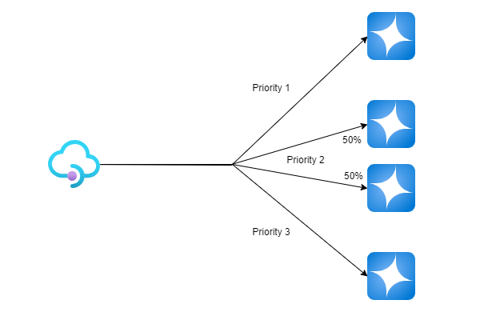
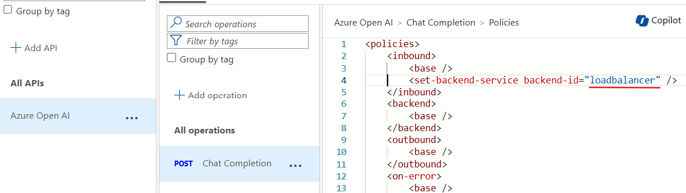

# Priority Base Load Balancer

You have many Azure AI Account and use one endpoint to the failure then use other sets for load balanced way, then finally most undesirable account (maybe far from user)

This is good for PTU and PAYG scenario with multiple regions



## Bicep

In [loadbalancer.bicep](./assets/loadbalancer.bicep), replace followings to match your environment.

```bicep
param apimName string = '<your APIM resource name>'
param aoaiOneUrl string = 'https://<AOAI account>.openai.azure.com/openai'
param aoaiTwoUrl string = 'https://<AOAI account>.openai.azure.com/openai'
param aoaiThreeUrl string = 'https://<AOAI account>.openai.azure.com/openai'
param aoaiFourUrl string = 'https://<AOAI account>.openai.azure.com/openai'

```

Then run 
```shell
az deployment group create -f .\loadbalancer.bicep -g <your resource group>
```
When you run the bicep, it will add five backends.

## API Operation

Finally, you can point the loadbalancer as your backend.



Now your query goes to both endpoint 50:50

# Priority Change or Weight Change

If you want to change the priority and/or weight, simply change the priority in services of the load balancer.