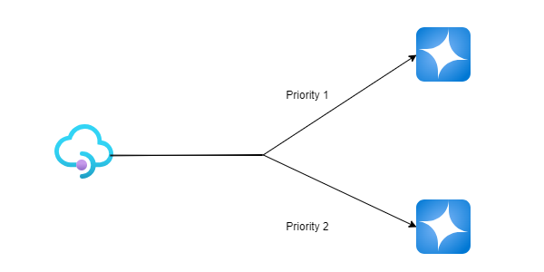
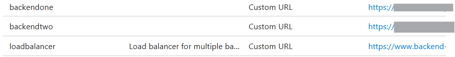
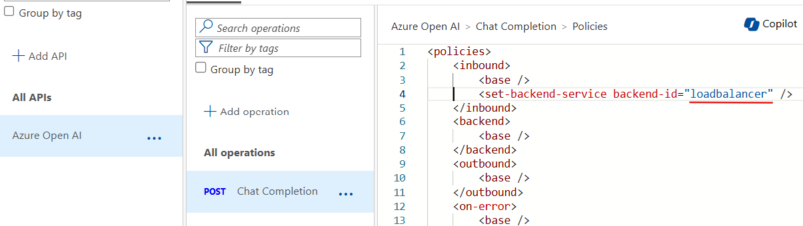

# Priority Base Load Balancer

You have two (or more) Azure AI Account and use one endpoint to the failure then use another one for certain amount of time.

This is good for PTU and PAYG scenario



## Bicep

In [loadbalancer.bicep](./assets/loadbalancer.bicep), replace followings to match your environment.

```bicep
param apimName string = '<your APIM resource name>'
param aoaiOneUrl string = 'https://<AOAI account>.openai.azure.com/openai'
param aoaiTwoUrl string = 'https://<AOAI account>.openai.azure.com/openai'
```

Then run 
```shell
az deployment group create -f .\loadbalancer.bicep -g <your resource group>
```
When you run the bicep, it will add three backends.



## API Operation

Finally, you can point the loadbalancer as your backend.



Now your query goes to both endpoint 50:50

# Priority Change

If you want to change the priority, simply change the priority in services of the load balancer.